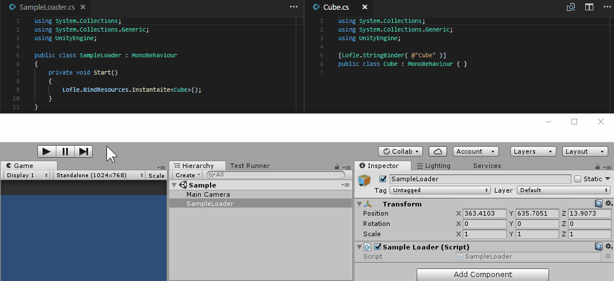

# BindResources



바인드 된 리소스를 가져오는 코드

``` csharp
using System.Collections;
using System.Collections.Generic;
using UnityEngine;

public class SampleLoader : MonoBehaviour
{
    private void Start()
    {
        // Cube 클래스를 전달하는 것 만으로 Instantaite 처리
        Lofle.BindResources.Instantaite<Cube>();
    }
}
```

바인드 된 코드

``` csharp
using System.Collections;
using System.Collections.Generic;
using UnityEngine;

[Lofle.StringBinder( @"Cube" )]
public class Cube : MonoBehaviour { }
```